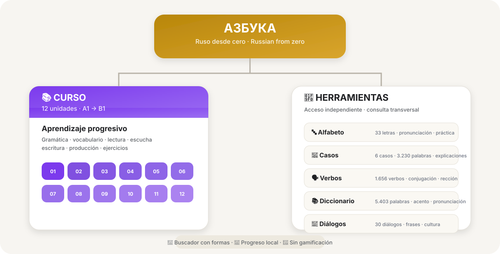

<div align="center">

# Азбука

### Russian from zero

[🇬🇧 English](README.md) · [🇪🇸 Español](README.es.md)

**A free, open-source web course for Spanish speakers who want to learn Russian from scratch.**

[**▶ Open Azbuka**](https://manum876.github.io/Azbuka_v3/) · [**Repository**](https://github.com/manum876/Azbuka_v3)

</div>

---

## About the project

**Азбука (Azbuka)** is a personal project that helps Spanish speakers learn Russian from zero up to roughly **B1 level**. The interface and all explanations are in Spanish (Rioplatense variety).

It combines a **12-unit course** with **reference tools** that can be opened at any time. All vocabulary lives in a **central dictionary** shared by the course and the tools: each word is written once, and every module shows it in its own way.

There are **no streaks, XP, lives, leaderboards or daily obligations**. Progress is stored in the browser, and learners decide when and what to study.

> **Learn in order. Look up what you need. Practise what you want.**

---

## How it is organised



- **Course:** 12 progressive units, A1 to B1, plus a final exam.
- **Tools:** reference and practice modules, independent of the course order.
- **Central dictionary:** the shared foundation.
- **Search:** finds words in Russian or Spanish, including inflected and conjugated forms.

---

## The course

Twelve progressive units, each designed for about a month of study:

| Unit | Main topic |
|---|---|
| **01** | Alphabet and pronunciation |
| **02** | Basic introductions |
| **03** | Nouns and gender |
| **04** | Basic cases: nominative and accusative |
| **05** | Present-tense verbs |
| **06** | Movement and location |
| **07** | Time and daily routine |
| **08** | Past tense |
| **09** | Future tense |
| **10** | Remaining cases: genitive, dative and instrumental |
| **11** | Everyday conversations |
| **12** | B1 consolidation |

The approach is **production-oriented**: learners write, translate, listen and build their own sentences, not just recognise answers. The course is cumulative, and each unit recycles earlier material.

> The units are being migrated to the new version of the app.

---

## Tools

### 📚 Dictionary

The foundation of the app: **5,403 words** (Comer 5000 plus additional vocabulary). Each word has:

- its **stress** marked;
- **IPA** and a **Spanish-style pronunciation guide** (jarashó, spasíba);
- its part of speech;
- one or more **senses**, with translation and definition in Spanish;
- gender, animacy and number for nouns, and aspect and aspectual partner for verbs.

Every word has its own entry page, with audio.

### 🗣️ Verbs

Conjugations for all **1,656 verbs** in the dictionary:

- present, future, past and imperative, with audio for every form;
- side-by-side comparison with the **aspectual partner** (imperfective / perfective);
- **government**: which case each verb takes, with explanations and examples.

### 📖 Cases

Declensions for **3,230 words**: nouns, adjectives, pronouns, determiners and numerals.

- The **6 cases**, singular and plural (or by gender for adjectives), with audio.
- Special forms: locative (в лесу́), partitive (ча́ю), short adjectives and the animate accusative.
- An explanation of each case, with examples that highlight which word is in that case and why.

### 🔤 Alphabet

Reference and practice for the **33 letters** of the Cyrillic alphabet: print and cursive forms, pronunciation explained in Spanish, common mistakes, look-alike letters, example words with audio, and tracking of mastered letters.

### 💬 Dialogues

A conversation guide: **30 dialogues** for everyday situations, many with an informal (ты) and a formal (вы) version, audio, a pronunciation guide and every word linked to the dictionary. It adds **52 useful phrases** worth learning as a whole and **9 cultural notes** that compare Russian customs with those of the Río de la Plata. A practice mode lets you play one of the characters.

---

## Philosophy

**1. A clear path.** The course offers an ordered progression from zero to B1.

**2. Freedom of use.** The tools can be opened at any time, without following the course order.

**3. A reliable reference.** To remember how to say something, conjugate a verb or understand a case, Azbuka should be enough on its own. That is why forms are never invented: they come from cross-checked sources and are reviewed by hand.

---

## Features

- 🎓 12-unit course, A1 → B1
- 📚 Central dictionary of 5,403 words, with stress, IPA and a pronunciation guide
- 🗣️ 1,656 conjugated verbs, with aspectual partners and government
- 📖 3,230 words declined in all 6 cases
- 🔤 Complete Cyrillic alphabet reference
- 💬 30 dialogues, 52 useful phrases and 9 cultural notes
- 🔎 Search in Russian or Spanish that also recognises inflected and conjugated forms
- 🔊 Russian audio via the browser's speech engine
- 💾 Progress stored in the browser
- 🌓 Light and dark themes
- 📱 Mobile-first
- 🚫 No gamification, no accounts, no servers or external APIs, no AI features

---

## Technology

- HTML, CSS and JavaScript, **no build step**.
- [Preact](https://preactjs.com/) + htm, bundled in the repository (`preact.js`).
- `localStorage` for progress and theme.
- The browser's Web Speech API for Russian audio.
- Hosted on **GitHub Pages**.

---

## Data sources

- **Vocabulary:** Comer, K. *Comer 5000* (Portland State University) and the [FreeDict](https://freedict.org/) Russian–Spanish dictionaries (CC BY-SA 3.0).
- **Conjugations and declensions:** data from [OpenRussian.org](https://github.com/Badestrand/russian-dictionary) (CC BY-SA 4.0).
- **Cross-checks:** the pymorphy3 morphological analyzer (OpenCorpora dictionary) and the stress indexes of Zaliznyak's Grammatical Dictionary.
- **Original content:** definitions, explanations and notes written for Azbuka.

---

## Running locally

```bash
git clone https://github.com/manum876/Azbuka_v3.git
cd Azbuka_v3
python3 -m http.server
```

Then open `http://localhost:8000` in your browser. A local server is needed because some pages load data files.

---

## Repository structure

```text
Azbuka_v3/
├── index.html            ← home
├── azbuka-index-1.html   ← A1 → B1 course index
├── ficha.html            ← word entry (dictionary)
├── alfabeto.html
├── verbos.html
├── casos.html
├── dialogos.html
├── core.css              ← shared styles
├── core.js               ← catalogue, search, storage
├── shell.js              ← side menu, header and bottom bar
├── progress.js           ← progress
├── preact.js             ← Preact + htm
├── data-lexicon.js       ← central dictionary
├── data-verbos.js        ← conjugations
├── data-casos.js         ← declensions
├── data-gramatica.js     ← grammar explanations
├── data-alphabet.js      ← alphabet
├── data-dialogos.js      ← dialogues
├── data-frases.js        ← useful phrases
├── data-cultura.js       ← cultural notes
├── azbuka-structure.svg
├── README.md
├── README.es.md
├── LICENSE
└── LICENSE-CONTENT
```

---

## Project status

🚧 **Under active development.** The app is being migrated to a new architecture, with a central dictionary and a shared design system.

- ✅ Home, course index, dictionary, Alphabet, Dialogues, Verbs and Cases.
- 🔜 The 12 course units.
- 🔜 Exercise bank and review.

---

## Contributions

Azbuka is a personal project by **Juan Manuel Muñoz**. The repository is open to explore, learn from and fork under its licences, but it does not accept direct changes from third parties. If you find a bug or have a suggestion, please open an issue.

---

## Licence

Azbuka uses **two licences**, because software and educational content have different goals.

- **Code:** MIT License. See [`LICENSE`](LICENSE).
- **Educational content** (course material, exercises, definitions, explanations): **CC BY-NC-ND 4.0**. See [`LICENSE-CONTENT`](LICENSE-CONTENT).
- **Exception:** the conjugation tables (`data-verbos.js`) and declension tables (`data-casos.js`) are derived from OpenRussian.org data and are distributed under **CC BY-SA 4.0**, as their original licence requires.

---

## Author

**Juan Manuel Muñoz**

A personal, independent project to make learning Russian from Spanish more structured, accessible and practical.

<div align="center">

[▶ Try Azbuka](https://manum876.github.io/Azbuka_v3/)

</div>
